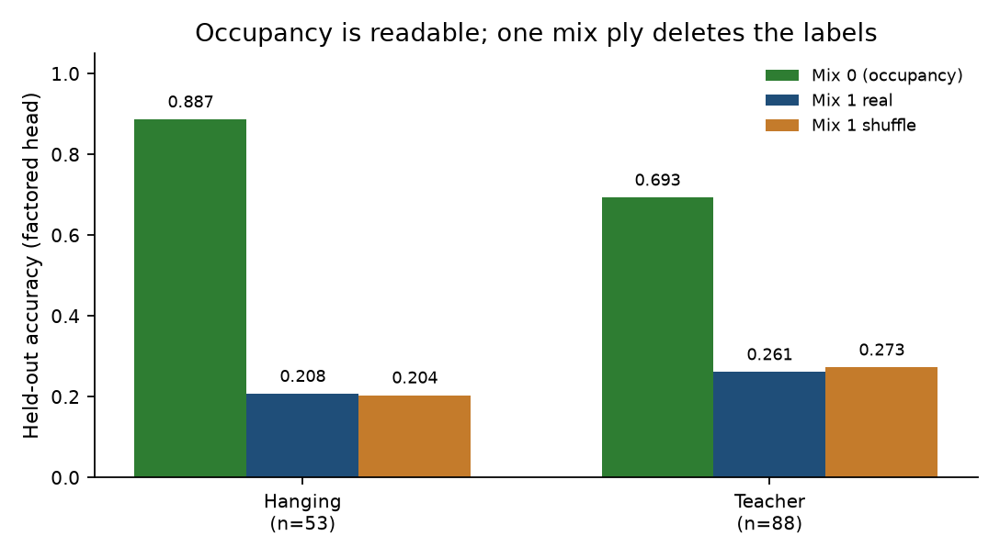
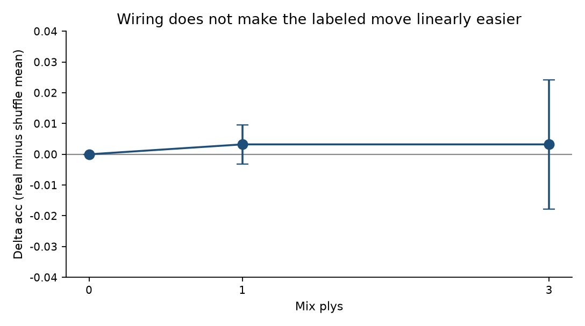
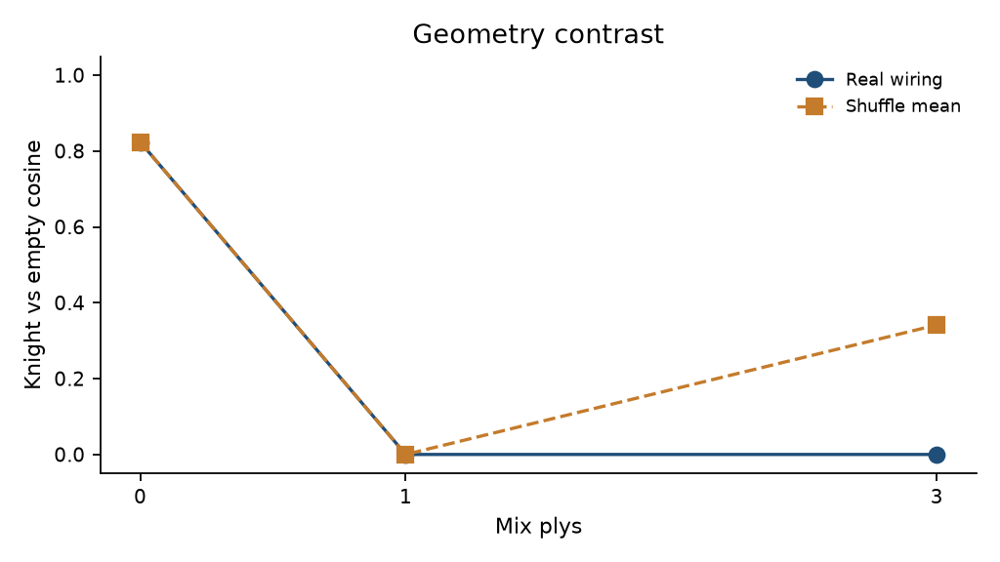
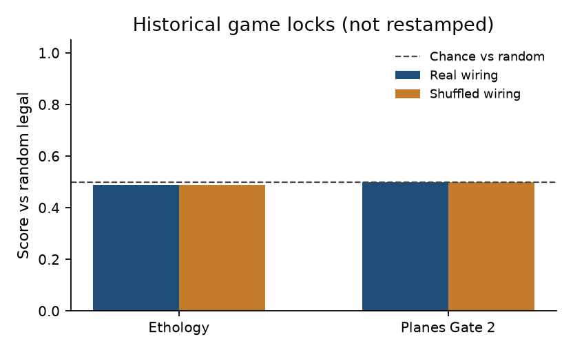

# fly_chess

Closed. A shuffle-controlled measurement on a fly-shaped LIF graph, not a chess engine.

**Question:** If this graph is run as LIF, the board is written into reserved channels, and a legal-move mask sits on the way out, does the wiring make the labeled move linearly easier than a degree-and-sign shuffle?

**Answer:** No. Mix 0 is a typed occupancy register (factored head reads hanging / teacher). Mix ≥ 1 erases those labels on both arms. At mix 3, teacher Δ includes 0. Cosine still splits real from shuffle. The wires do something; they do not do this.

**Translation:** We write the chessboard into some input cells, run the fly map as a simple neuron model, and only allow legal moves out. So the question is, *does the real wiring make the intended move easier to read than a copy of the same map with the same cells and the same number of connections, just attached to the wrong partners?*

**Answer:** No. At the inputs you can still see the board: a small readout can spot a hanging piece or “get out of check.” After the signal passes through the network once, that information is gone on the real map and on the rewired copy. The real wiring still leaves a fingerprint in the activity pattern. It does not decide the move. If the rewired copy does as well, the fly’s specific partners were not what picked it.

Write-up: [docs/planes_note.md](docs/planes_note.md). Three sentences. The plots are the argument.

1. Reserved pools reconstruct occupancy; a factored from-to head reads a hanging/teacher label from that register.



`logs/planes_labels.json`, hanging n_eval=53, teacher n_eval=88, five seeds.

2. One mix ply removes those labels on real and shuffled wiring.



`logs/planes_mix.json`, n_eval=62, five seeds. Caption: wiring does not make the labeled move linearly easier.

3. Hidden geometry differs after three plys; the labeled move does not.



`logs/planes_mix.json`, n_eval=62, five seeds.

Do not start another linear head on this object. Occupancy is readable before a ply. One mix ply deletes the labels. More FENs will not restore that code.

## Locked numbers

Copied from `logs/`. Do not restamp ethology 0.4875 / 0.4875 or Gate 2 n=40 onto the occupancy register.

**Planes labels** (`logs/planes_labels.json`), five shuffle seeds, encoder frozen, no engine:

| Family | Mix 0 factored real / shuffle | Mix 1 factored real / shuffle | Mix 3 linear Δ [95%] |
|--------|------------------------------:|------------------------------:|---------------------:|
| Hanging | 0.887 / 0.887 | 0.208 / 0.204 | 0.011 [-0.003, 0.026] |
| Teacher | 0.693 / 0.693 | 0.261 / 0.273 | -0.016 [-0.050, 0.018] |

Check-escape flee_ok = 1.0 at every depth on both arms: the legal mask is the decoder. Do not quote a check-escape exact-match as wiring or occupancy.

**Mix-depth** (`logs/planes_mix.json`), 130 train / 62 eval FENs:

| Mix plys | Real acc | Shuffle acc | Δ acc mean [95%] | Knight-empty cosine |
|----------|--------:|------------:|------------------:|--------------------:|
| 0 | 0.226 | 0.226 | 0.00 [0.00, 0.00] | 0.824 / 0.824 |
| 1 | 0.177 | 0.174 | 0.003 [-0.003, 0.010] | 0 / 0 |
| 3 | 0.177 | 0.174 | 0.003 [-0.018, 0.024] | 0 / 0.341 |

Factored occupancy read at mix 0 is 0.790, Δ 0. `logs/planes_head.json` is a one-seed pointer (n_eval=10, rank 3.9 vs 1.9). Leave it.

**Ethology and Gate 2 (historical game locks, n=40, random legal opponent):**



`logs/ethology_gate.json` and `logs/planes_gate.json`, n=40. Historical. Not restamped. Chance line is score vs random, not Elo.

| Interface | Score | Shuffled |
|-----------|------:|---------:|
| Ethology | 0.4875 | 0.4875 |
| Planes Gate 2 | 0.50 | 0.50 |

`wiring_is_encoder` false. Hanging-capture 0.177 vs 0.159 is not a win (774 vs 668 chances). Check-escape 1.0 is the mask (41 vs 31 positions).

**MaleCNS 475-cell circuit** (not games): sugar lights MN9, loom lights DNp01, shuffle crosstalks. The 475-cell MaleCNS identity/circuit work is a different object (sugar → MN9, loom → DNp01, shuffle crosstalk). It is a path check on a slice. It is not the planes readout and not a move class. 12.5 Hz and 37.5 Hz are injected-pulse responses on an intact path, and MN9 is a two-cell mean. 8.0 current-units is a grid pick because 4.0 was silent, not a fly biophysics constant. Required-role signs all +1 is the 475-cell mix, not a whole-brain transmitter table. Hop 1 already hits the 8,000 cap, so 917 cells is a budgeted probe, not the true 2-hop map. `docs/dynamics.md`.

## Reproduce

```bash
/opt/homebrew/bin/python3.12 -m venv .venv
.venv/bin/python -m pip install -e ".[dev]"
.venv/bin/python -m pytest
.venv/bin/python -m pip install -e ".[figures]"
.venv/bin/python scripts/make_readme_figures.py
```

Optional: rerun the closed planes tables (does not change ethology or Gate 2):

```bash
.venv/bin/python -m fly_chess mix-sweep
.venv/bin/python -m fly_chess labels-sweep
```

MaleCNS identity/circuit only. No ply loop on 166k cells:

```bash
.venv/bin/python -m pip install -e ".[malecns]"
.venv/bin/python -m fly_chess fetch
.venv/bin/python -m fly_chess identity --source malecns
.venv/bin/python -m fly_chess circuit --source malecns
```

`play --source malecns` exits. No Lichess. No Elo. Fixture: 1,007 cells. MaleCNS slice: 475 cells.

## Layout

| Path | Role |
|------|------|
| `docs/planes_note.md` | Methods + negative-result note |
| `docs/fig_labels.png` | Occupancy mix 0 vs mix 1 |
| `docs/fig_delta.png` | Shuffle-controlled delta |
| `docs/fig_cosine.png` | Knight vs empty cosine |
| `docs/fig_games.png` | Historical game locks, n=40 |
| `scripts/make_readme_figures.py` | Rebuild figures from lock JSON |
| `docs/dynamics.md` | MaleCNS kernel and 2-hop abort |
| `logs/planes_labels.json` | Label-family mix table |
| `logs/planes_mix.json` | Mix-depth × five seeds |
| `logs/planes_head.json` | One-seed pointer |
| `logs/ethology_gate.json` | Paint controller, n=40 |
| `logs/planes_gate.json` | Gate 0 to 2 history, n=40 |
| `logs/malecns_identity.json` | 475-cell identity |
| `logs/malecns_circuit.json` | 475-cell paint check |
| `logs/malecns_hop_probe.json` | Capped LPLC2 neighborhood |
| `config/lif.json` | `fixture_voltage_jump`, `malecns_current` |
| `config/planes.json` | Typed pools and mix_plies |
| `data/fixtures/graph.json` | Fixture graph |
| `src/fly_chess/labels.py` | Teacher: hanging else escape else exclude |
| `src/fly_chess/head.py` | LinearHead, FactoredHead |
| `description.txt` | GitHub hook |

Sequel work needs a new question. Code is MIT. MaleCNS data stays CC BY 4.0 (Berg et al., *Cell* 2026).
